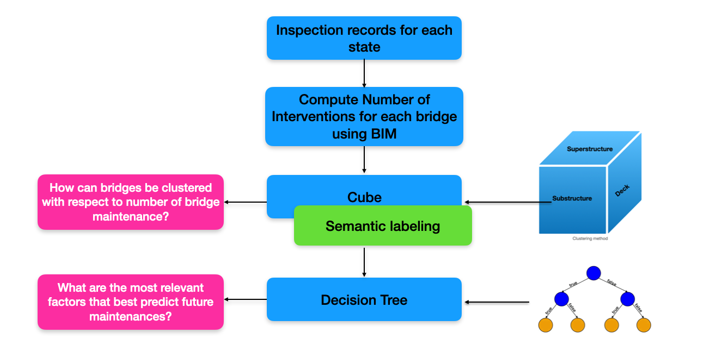
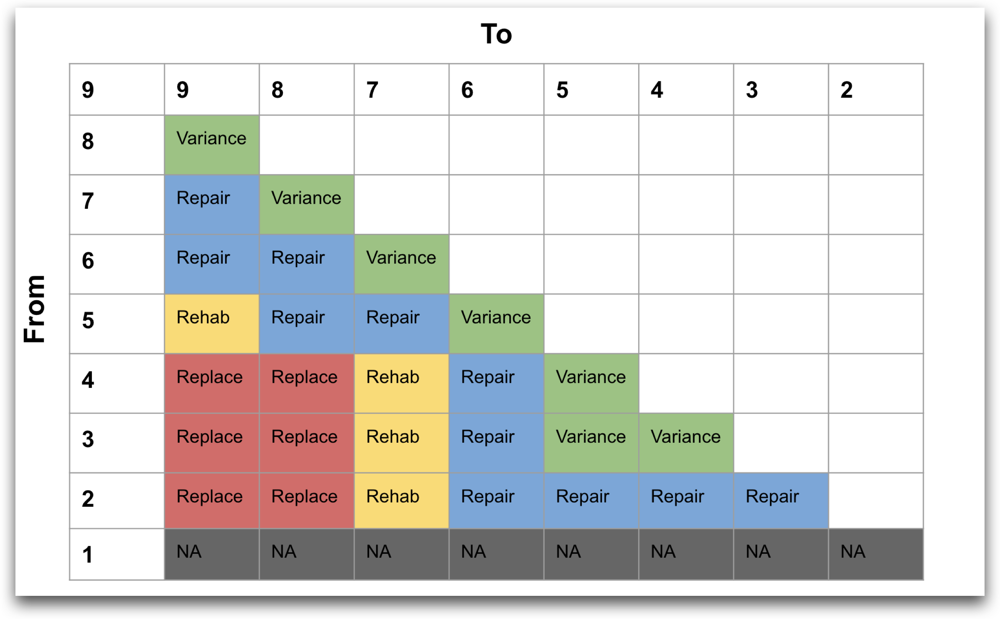

<h1 align='center'>
🌉  Predicting Bridge Maintenance Using Decision Trees  🌟
</h1>

The repository is implementation of prediction models to identify future bridge deterioration and maintenance using the existing National Bridge Inventory (NBI) dataset. This project is a part of the Bridging Big Data Group and SMARTI at University of Nebraska, Omaha. 

    [Interactive visualization of Results by Ashley Ramsay](https://repairs.ricks.io/)

### 🎯 Background
- Bridges are critical infrastructure whose maintenance is a key responsibility for both government and private organizations. 
- Costly to build and repair, bridges are valuable assets that can benefit from improved predictive maintenance.
- In this work, we present a novel, straightforward, non-parametric method for doing predicting future maintenance and identifying influential factors to predict future maintenances of the bridges.

### 💪 Challenge
- In the NBI dataset, it is a **challenge** to identify maintenance patterns. Because, the `reconstruction_year` does not provide an valuable information about the type of repair or reconstruction done.
- Moreover, for every bridge time-line, the improvement in the condition ratings often does not map with the data in `reconstruction_year`.

### 🎯 Objective
- The objective of this research study is to develop a methodology for computing bridge maintenance frequency and based on existing timelines of the available data predict future time-line by accounting for improvement in the condition ratings.

### 🧪 Solution
- To address this challenge we can use bridge intervention matrix, that utilizes the bridge intervention matrix for `deck` to identify various types of intervention depending on the probability of the transition.
 

- The project contains several models which are broadly specified under two categories:
    * **Deterioration models:** In general, deterioration models predict the future deterioration of bridge conditions.
    * **Maintenance models:** In general, maintenance model predict the future maintenance of bridge conditions. There are three main components for which maintenance models can make predicitons:
        1. Substructure
        2. Superstructure
        3. Deck

### 👉 References
| Document      | Documentation type | Description |
| ------------- | ------------------ | ----------- |
| [Quickstart](docs/quickstart.md) | Concept | An overview and guide to setup this project |
| [Methodology](docs/methodology.md) | Concept, Task | Simplest possible method of implementing your API |
| [Functions](docs/functions.md) | Reference | List of references for the functions used|
| [Related Projects](docs/related-projects.md) | Reference | List of projects related to this repository |

## Contact
- Akshay Kale - [Email](akale@unomaha.edu)
